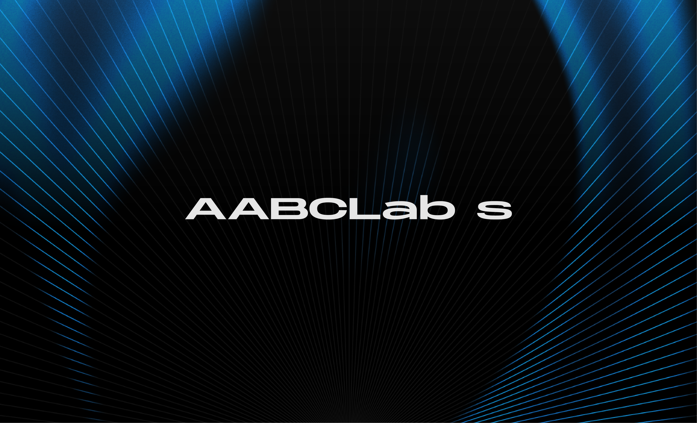

<p align="center">
  
</p>

# AABC Agent - Blockchain AI Agent Framework

> Advanced AI agent framework with Solana blockchain integration

[](https://opensource.org/licenses/MIT)
[](https://www.python.org/downloads/)
[](https://solana.com/)

## 🌟 Overview

AABC Agent is an advanced AI agent framework that combines intelligent automation with comprehensive Solana blockchain operations. Built on top of [Solana Agent Kit](https://github.com/sendaifun/solana-agent-kit), this framework provides both a Python-based AI agent system and a Node.js blockchain bridge for seamless Web3 integration.

### What Makes AABC Agent Unique

- **Multi-Language Architecture**: Python AI agents with Node.js blockchain bridge
- **Production Ready**: Built on battle-tested [Sendai's Solana Agent Kit](https://docs.sendai.fun/docs/v2/introduction)
- **Comprehensive DeFi**: Native support for Jupiter, Raydium, Orca, Meteora, and more
- **Extensible Design**: Plugin-based architecture for easy customization

## ✨ Key Features

### 🔗 Blockchain Integration
- **Solana Network Operations**
  - Token balance checking (SOL & SPL tokens)
  - Token transfers and swaps via Jupiter, Raydium, Orca
  - Token deployment and management with Metaplex
  - Blinks (Blockchain Links) creation and execution
  - Stake SOL and interact with validators
  - NFT minting and collection management

### 💹 DeFi Protocol Support
- **DEX Integration**
  - Jupiter Aggregator for best swap prices
  - Raydium AMM pools (CPMM, CLMM, AMMv4)
  - Orca Whirlpool liquidity provision
  - Meteora DLMM and Alpha Vaults
  - Manifest limit orders
- **Advanced Operations**
  - Token launches via Pump.fun and PumpPortal
  - Cross-chain bridging with Wormhole and deBridge
  - Price feeds from Pyth Network
  - Risk analysis with Rugcheck
  - Perpetuals trading on Adrena and Drift

### 🤖 AI Agent Capabilities
- Multi-step task execution with Claude
- Tool-based architecture for extensibility
- Natural language command processing
- MCP (Model Context Protocol) support
- Parallel operation execution
- Comprehensive error handling and retry logic

## 🚀 Quick Start

### Prerequisites

```bash
Python 3.11+
Node.js 20+ (for blockchain bridge)
```

### Installation

```bash
# Clone the repository
git clone https://github.com/YOUR_ORG/aabc-agent-open-source.git
cd aabc-agent-open-source

# Install Python dependencies (Agent)
pip install -r requirements.txt

# Install Node.js dependencies (Solana Bridge)
cd solana-bridge
npm install
cd ..

# Set up environment variables
cp .env.example .env
cp solana-bridge/.env.example solana-bridge/.env
# Edit .env files with your configuration
```

### Running the Services

```bash
# Terminal 1: Start Solana Bridge
cd solana-bridge
npm start
# Bridge running on http://localhost:3001

# Terminal 2: Start Agent
python -m agent.run
```

### Basic Usage

```python
from agent.run import AgentRunner
from agent.prompt import get_system_prompt

# Initialize agent
agent = AgentRunner(
    model="claude-sonnet-4",
    system_prompt=get_system_prompt()
)

# Execute a crypto research task
response = await agent.run(
    "Analyze $SOL token investment potential"
)
```

## 📚 Architecture

### System Design

```
┌─────────────────────────────────────────────────────────────┐
│                     Python AI Agent Layer                    │
│  ┌─────────────┐  ┌──────────────┐  ┌──────────────────┐   │
│  │   Claude    │  │   Prompt     │  │  Tool Manager    │   │
│  │   Sonnet    │─▶│  Engineering │─▶│  & Orchestrator  │   │
│  └─────────────┘  └──────────────┘  └─────────┬────────┘   │
└────────────────────────────────────────────────┼────────────┘
                                                 │ HTTP/REST
                        ┌────────────────────────┴────────────┐
                        │    Node.js Blockchain Bridge        │
                        │  ┌──────────────────────────────┐   │
                        │  │   Solana Agent Kit Service   │   │
                        │  └─────────────┬────────────────┘   │
                        │  ┌─────────────┴────────────────┐   │
                        │  │    Jupiter | Raydium | Orca  │   │
                        │  │  Meteora | Pyth | Rugcheck   │   │
                        │  └─────────────┬────────────────┘   │
                        └────────────────┼────────────────────┘
                                         │ Solana Web3.js
                        ┌────────────────┴────────────────────┐
                        │         Solana Blockchain           │
                        │  Mainnet/Devnet/Testnet RPC Node    │
                        └─────────────────────────────────────┘
```

### Core Components

```
aabc-agent-open-source/
├── agent/                     # Python AI Agent
│   ├── prompt.py              # System prompts and agent behavior
│   ├── run.py                 # Agent execution engine
│   ├── tools/                 # Tool implementations
│   │   └── blockchain_tools/  # Solana blockchain tools
│   │       ├── solana_balance_tool.py
│   │       ├── solana_swap_tool.py
│   │       ├── solana_token_tool.py
│   │       ├── solana_transfer_tool.py
│   │       └── solana_blinks_tool.py
│   └── utils.py               # Utility functions
├── solana-bridge/             # Node.js Blockchain Bridge
│   ├── index.js               # Express API server
│   ├── routes/                # API endpoints
│   │   ├── solana.js          # Wallet operations
│   │   ├── token.js           # Token operations
│   │   ├── defi.js            # DeFi operations
│   │   ├── blinks.js          # Blinks creation
│   │   └── nft.js             # NFT operations
│   └── services/              # Business logic
│       ├── agentService.js    # Solana Agent Kit integration
│       ├── jupiterService.js  # Jupiter DEX
│       ├── tokenService.js    # Token info
│       └── blinksService.js   # Blinks generation
└── blockchain_tools/          # Standalone blockchain tools
```

### Technology Stack

**AI & Language Models**
- Anthropic Claude (Sonnet 4) for agent reasoning
- LangChain for tool orchestration
- MCP protocol for external integrations

**Blockchain**
- Solana Web3.js for blockchain interaction
- Solana Agent Kit for high-level operations
- Metaplex for NFT/Token standards

**Backend**
- Python 3.11+ with AsyncIO
- Node.js 20+ with Express
- RESTful API architecture

**DeFi Protocols**
- Jupiter Aggregator V6 API
- Raydium SDK
- Orca Whirlpools SDK
- Meteora DLMM
- Pyth Price Feeds

### Blockchain Tools

#### SolanaBalanceTool
Check SOL and SPL token balances on Solana blockchain.

```python
from blockchain_tools.solana_balance_tool import SolanaBalanceTool

tool = SolanaBalanceTool()
result = await tool.get_balance(wallet_address="YOUR_WALLET")
```

#### SolanaSwapTool
Execute token swaps on Solana DEXs (Jupiter, Raydium, Orca).

```python
from blockchain_tools.solana_swap_tool import SolanaSwapTool

tool = SolanaSwapTool()
result = await tool.swap_tokens(
    from_token="SOL",
    to_token="USDC",
    amount=1.0
)
```

#### SolanaTokenTool
Get detailed token information and metadata.

```python
from blockchain_tools.solana_token_tool import SolanaTokenTool

tool = SolanaTokenTool()
result = await tool.get_token_info(token_address="TOKEN_MINT")
```

## 🎯 Use Cases

### 1. Cryptocurrency Research
```python
# Automatic 6-source parallel analysis
agent.run("Analyze $WIF investment value")

# Output: Comprehensive report with:
# - Price trends and technical indicators
# - Social sentiment score (0-100)
# - On-chain metrics
# - Latest news and research
# - DeFi performance
# - Investment recommendations
```

### 2. Token Operations
```python
# Check balance
agent.run("What's my SOL balance?")

# Swap tokens
agent.run("Swap 1 SOL to USDC")

# Get token info
agent.run("Get information about $BONK token")
```

### 3. Blinks Creation
```python
# Create a Blink for token transfer
agent.run("Create a Blink to transfer 0.1 SOL to ADDRESS")

# Shareable URL for one-click blockchain action
```

## 🔧 Configuration

### Environment Variables

```bash
# .env.example

# Blockchain Configuration
SOLANA_RPC_URL=https://api.mainnet-beta.solana.com
SOLANA_WALLET_PRIVATE_KEY=your_private_key

# AI Model Configuration
ANTHROPIC_API_KEY=your_anthropic_api_key
MODEL_NAME=claude-sonnet-4

# Optional: Additional Data Sources
MESSARI_API_KEY=your_messari_key
DELPHI_API_KEY=your_delphi_key
```

## 🔌 Powered By

This project is built on top of several excellent open-source projects:

- **[Solana Agent Kit](https://github.com/sendaifun/solana-agent-kit)** - Core Solana blockchain integration
- **[Sendai Documentation](https://docs.sendai.fun/docs/v2/introduction)** - Comprehensive Solana agent framework
- **[Anthropic Claude](https://anthropic.com)** - Advanced AI language models
- **[Jupiter](https://jup.ag)** - Best price aggregation for token swaps
- **[Raydium](https://raydium.io)** - Automated market maker and liquidity provider
- **[Orca](https://orca.so)** - User-friendly DEX on Solana

## 🛠️ Advanced Features

### Blockchain Operations
- **Token Management**: Deploy, transfer, swap, and manage SPL tokens
- **DeFi Integration**: Stake, provide liquidity, and interact with major protocols
- **NFT Operations**: Create, mint, and manage NFT collections
- **Blinks Support**: Create shareable blockchain action URLs
- **Multi-DEX Routing**: Automatic best price discovery across Jupiter, Raydium, Orca

### AI Agent Capabilities
- **Natural Language Processing**: Execute blockchain operations via conversational commands
- **Multi-Step Reasoning**: Complex task decomposition and execution
- **Tool Orchestration**: Automatic selection and sequencing of blockchain tools
- **Error Handling**: Intelligent retry logic and transaction simulation

## 🤝 Contributing

We welcome contributions from the community!

### Development Setup

```bash
# Install development dependencies
pip install -r requirements-dev.txt
cd solana-bridge && npm install --save-dev

# Format code
black agent/
prettier --write "solana-bridge/**/*.js"
```

### Contribution Guidelines

1. Fork the repository
2. Create a feature branch (`git checkout -b feature/amazing-feature`)
3. Commit your changes (`git commit -m 'Add amazing feature'`)
4. Push to the branch (`git push origin feature/amazing-feature`)
5. Open a Pull Request

## 📄 License

This project is licensed under the MIT License - see the [LICENSE](LICENSE) file for details.

## 🔒 Security

- Never commit private keys or `.env` files
- Use environment variables for sensitive data
- Implement proper authentication in production
- Review transaction parameters before execution
- Test thoroughly on devnet before mainnet deployment

## 📚 Resources

- **Solana Agent Kit**: [GitHub](https://github.com/sendaifun/solana-agent-kit) | [Documentation](https://docs.sendai.fun/docs/v2/introduction)
- **Solana Documentation**: [docs.solana.com](https://docs.solana.com)
- **Jupiter API**: [station.jup.ag/docs](https://station.jup.ag/docs)
- **Anthropic Claude**: [docs.anthropic.com](https://docs.anthropic.com)

## ⚠️ Disclaimer

This software is provided for educational and research purposes. Cryptocurrency trading and blockchain operations involve significant risk. Always do your own research and never invest more than you can afford to lose.

---

**Built by AABC Labs**
